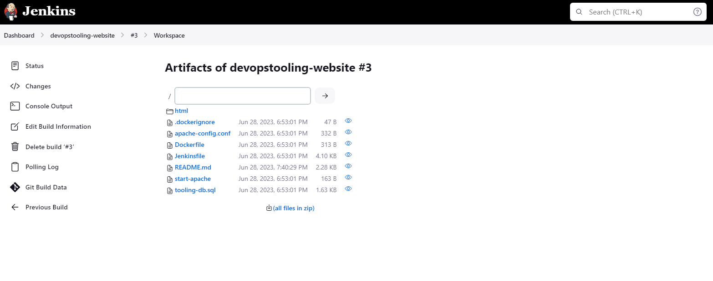
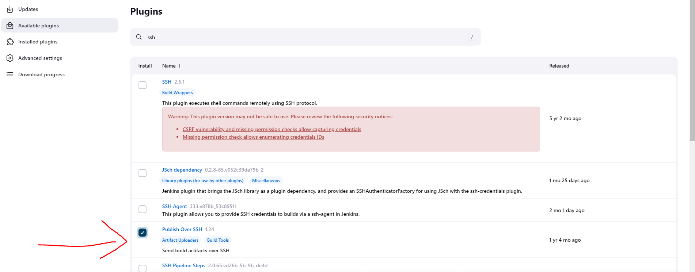

# CONTINUOUS INTEGRATION PIPELINE FOR TOOLING WEBSITE


### INSTALLING JENKINS

Launch an EC2 instance running on ubuntu, and ensure the port 8080 is open via the security group.

SSH into the system and run the following commands to install jenkins.

```
curl -fsSL https://pkg.jenkins.io/debian-stable/jenkins.io-2023.key | sudo tee \
    /usr/share/keyrings/jenkins-keyring.asc > /dev/null

echo deb [signed-by=/usr/share/keyrings/jenkins-keyring.asc] \
    https://pkg.jenkins.io/debian-stable binary/ | sudo tee \
    /etc/apt/sources.list.d/jenkins.list > /dev/null

sudo apt-get update
sudo apt-get install fontconfig openjdk-11-jre
sudo apt-get install jenkins

```


Open the port 8080 on via the security group inbound rule of the jenkins server


Now that Jenkins has been installed, the port is open and now we can test it by running it on the website using the format `<jenkins_server_public_ip>:8080`


The password is obtained from the file path using the command `cat /var/lib/jenkins/secrets/initialAdminPassword`


## Attaching Webhook to Jenkins Server

The github has been forked to my repo. On the github repository, I will create a webhook to connect to the jenkins server. This is done by going to the settings tab on the github repo and click on webhooks. The webhook should look like `<public_ip_of_jenkins_server>:8080/github-webhook/`


## Creating Job and Configuring GIT Based Push Trigger

A new freestyle job is created. The job will be configured to build from the git repo that was forked previously. The repo is public so there will be no need for credentials, and the branch (master) will be specified. After the configuration, the code will be built manually.


## Configuring Build Triggers
Now we need to add some automation by enabling the jenkins server build automatically when triggered by a webhook event from github. 


### configure "Post-build Actions" to archive all the files 
The files resulted from a build are called artifacts.


After the configurations have been set, we can test our build by making a change/push to the git repo and see jenkins automatically build the project. 




Our created artifact can be found on the jenkins server at the path `/var/lib/jenkins/jobs/tooling_github/builds/<build_number>/archive/`

## Configuring Jenkins to Copy Files to the NFS Server

Firstly, the plugin 'Publish via SSH' is installed. The plugin allows created artifacts to be sent to a remote server via ssh. It can can be expanded for other applications but for now we will be using the plugin to send files to the NFS server. 



Configure the job to copy artifacts over to NFS server. On main dashboard select "Manage Jenkins" and choose "Configure System" menu item.

Scroll down to Publish over SSH plugin configuration section and configure it to be able to connect to the NFS server:

Provide a private key (content of .pem file that you use to connect to NFS server via SSH/Putty)

Hostname – can be private IP address of NFS server
Username – ec2-user (since NFS server is based on EC2 with RHEL 8)
Remote directory – /mnt/apps since our Web Servers use it as a mointing point to retrieve files from the NFS server

Test the configuration and make sure the connection returns Success. Remember, that TCP port 22 on NFS server must be open to receive SSH connections.


We specify ** on the send build artifacts tab meaning it sends all artifact to specified destination path(NFS Server).


We can see that it was successful from the console output


We verify on the nfs server


Now make a new change on the source code and push to github, Jenkins builds an artifact by downloading the code into its workspace based on the latest commit and via SSH it publishes the artifact into the NFS Server to update the source code.


